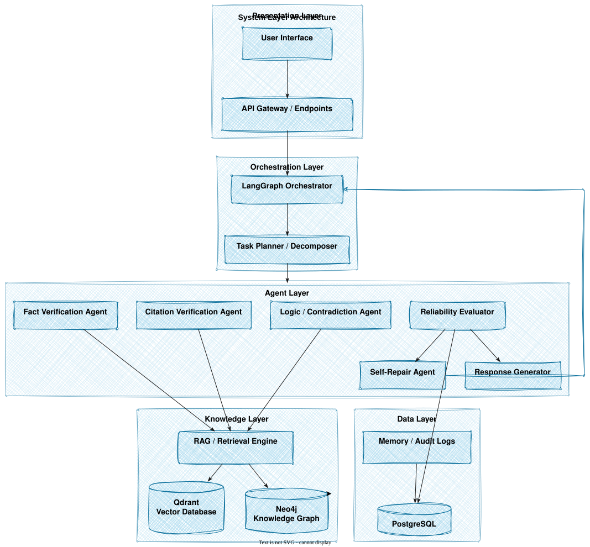
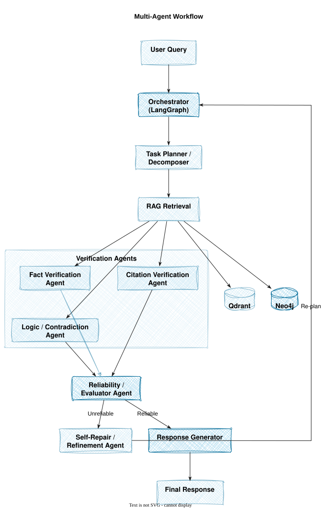
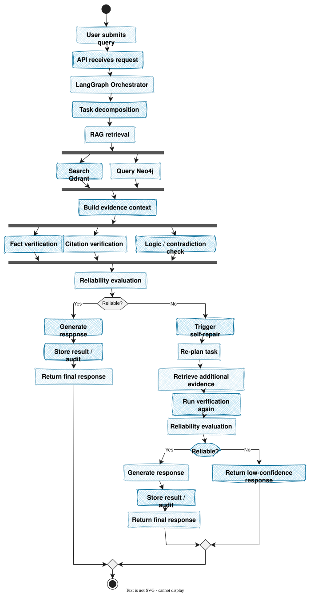

# AURA — Agentic Multi-Agent Framework for LLM Fact Verification & Hallucination Mitigation

AURA audits an LLM-generated response (or a user query + response pair), decomposes it into verifiable claims, checks each claim against retrieved evidence and structured knowledge, aggregates the results into a reliability assessment, and — where needed — rewrites unsupported or contradictory content before returning a final, evidence-grounded answer.

AURA does not claim to eliminate hallucination. It detects unsupported or conflicting content, grounds corrections in verified evidence, and is explicit about what it could *not* verify rather than silently passing it through.

---

## Status

Week 1 (foundation layer) — in progress. See [`AURA_Week1_Foundation_Plan.docx`](./AURA_Week1_Foundation_Plan.docx) for the current sprint plan and owner assignments.

---

## Architecture

The system is organized into five layers. Each layer is documented below with its corresponding diagram. Diagram source files live in `doc/daigrams/` — copy the SVGs from this delivery into that folder (see [Repo layout for diagrams](#repo-layout-for-diagrams) at the end of this section) so the links below resolve on GitHub.

### 1. System layer view



- **Presentation Layer** — User Interface → API Gateway / Endpoints. This is the only layer a client talks to.
- **Orchestration Layer** — LangGraph Orchestrator → Task Planner / Decomposer. Owns state, sequencing, and the re-plan loop back from the Agent Layer.
- **Agent Layer** — Fact Verification Agent, Citation Verification Agent, Logic / Contradiction Agent, and Reliability Evaluator run here. The Evaluator routes to either the Self-Repair Agent or the Response Generator. The Self-Repair Agent's output does not go straight to the user — it feeds back into the LangGraph Orchestrator, which re-runs planning and retrieval before the Agent Layer is invoked again.
- **Knowledge Layer** — RAG / Retrieval Engine backed by Qdrant (vector search) and Neo4j (knowledge graph). Called by the Fact and Citation agents, and again on every re-plan cycle.
- **Data Layer** — Memory / Audit Logs, persisted to PostgreSQL. Written to by both the Reliability Evaluator and the Response Generator.

### 2. End-to-end processing architecture



This is the same system redrawn as a straight-line data-flow, layer by layer:

`Input Layer → Orchestration Layer → Knowledge Layer → Verification Layer → Assessment Layer → Response Layer`

- **Input Layer** — accepts the raw user query or the LLM response under audit.
- **Orchestration Layer** — Orchestrator (LangGraph) hands off to Planner / Task Decomposition, which breaks the input into individually checkable claims.
- **Knowledge Layer** — RAG / Retrieval Engine queries the vector DB (Qdrant) and knowledge graph (Neo4j) in parallel for each claim.
- **Verification Layer** — Fact Verification Agent and Citation Verification Agent run against the retrieved evidence; both feed the Contradiction / Logic Agent, which checks claims against each other, not just against evidence.
- **Assessment Layer** — Reliability / Evaluator Agent aggregates the three verification outputs into a single score and writes the record to Memory / Audit Storage (PostgreSQL) regardless of outcome.
- **Response Layer** — Response Generator produces the final output on a pass; Response Refinement / Self-Repair Agent handles a fail. The diagram's feedback line runs from this layer back to the Orchestrator — a failed check triggers a new orchestration pass, not a local retry.

### 3. Multi-agent workflow


Names the concrete agents and their call graph:

1. **User Query** → **Orchestrator (LangGraph)**
2. Orchestrator → **Task Planner / Decomposer**
3. Planner → **RAG Retrieval**, which fans out to **Qdrant** and **Neo4j**
4. Retrieved evidence goes to the **Verification Agents** group: **Fact Verification Agent**, **Citation Verification Agent**, **Logic / Contradiction Agent**. The Logic/Contradiction Agent consumes the other two agents' outputs, not just raw evidence.
5. All three converge on the **Reliability / Evaluator Agent**, which branches:
   - **Reliable** → **Response Generator** → **Final Response**
   - **Unreliable** → **Self-Repair / Refinement Agent** → **Response Generator**
6. The diagram shows an explicit **"Re-plan"** edge from the Response Generator back to the Orchestrator — this is the loop used when a repair still doesn't clear the reliability bar, bounded by `MAX_ITERATIONS` (see [Configuration reference](#configuration-reference)).

### 4. Use-case view (user-facing)


The same pipeline from the caller's perspective, grouped as an "AI Query Processing System" boundary:

- **Submit Query** → **Retrieve Knowledge** → **Verify Information** (Verify Facts, Verify Citations, Check Logic / Contradictions) → **Evaluate Reliability**
- **Reliable** → **Generate Response**
- **Unreliable** → **Self-Repair / Refine Response**, which **re-retrieves** (loops back into Retrieve Knowledge) rather than re-verifying stale evidence
- Either path ends at **View Final Response**, followed by **View Confidence / Evaluation** — the caller always gets the reliability score alongside the answer, not just the answer.

### 5. Detailed activity flow (with the bounded self-repair loop)



The full step-by-step trace, including the one-retry bound enforced by `MAX_ITERATIONS`:

```
User submits query
  → API receives request
  → LangGraph Orchestrator
  → Task decomposition
  → RAG retrieval → [Search Qdrant | Query Neo4j] (parallel)
  → Build evidence context
  → [Fact verification | Citation verification | Logic/contradiction check] (parallel)
  → Reliability evaluation
  → Reliable?
      Yes → Generate response → Store result/audit → Return final response
      No  → Trigger self-repair → Re-plan task → Retrieve additional evidence
              → Run verification again → Reliability evaluation
              → Reliable?
                  Yes → Generate response → Store result/audit → Return final response
                  No  → Return low-confidence response
```

Two points this diagram makes explicit that the higher-level views don't:

- The retry path re-runs retrieval (`Retrieve additional evidence`), not just re-verification against the same evidence — a failed check is treated as a possible evidence-coverage gap, not only a model error.
- There is exactly one retry cycle in this flow. If the second reliability evaluation still fails, the system returns a **low-confidence response** rather than looping again — this is the diagram-level expression of the `MAX_ITERATIONS = 2` cap.

<a id="repo-layout-for-diagrams"></a>
**Repo layout for diagrams:** place the five SVGs at:

```
doc/daigrams/
├── Layer_Diagram .svg
├── Arc_Diagram.svg
├── Agent_Workflow.svg
├── UseCase_Workflow .svg
└── System_Worlfow.svg
```

All five diagrams above are referenced as `.svg`. If you keep the images elsewhere, or export any of them as `.png` instead, update that file's path/extension in this README to match.

---

## Documentation map

| Doc | What's in it | Read it when |
|---|---|---|
| [`AURA_ARCHITECTURE_README.md`](./AURA_ARCHITECTURE_README.md) | Full system design: components, data flow, cost/latency budget, tech stack, limitations | You're designing or reviewing a new component |
| [`AGENTS.md`](./AGENTS.md) | Per-agent contract: inputs/outputs, guardrails, failure modes | You're implementing or testing an agent |
| [`SKILLS.md`](./SKILLS.md) | Reusable deterministic/tool functions agents call into | You're deciding whether logic belongs in a skill vs. an agent prompt |
| [`CODING_STANDARDS.md`](./CODING_STANDARDS.md) | Schema rules, LLM-output parsing pattern, determinism requirements, testing checklist | Before opening a PR |
| [`AURA_Week1_Foundation_Plan.docx`](./AURA_Week1_Foundation_Plan.docx) | Current sprint plan, owner assignments, day-by-day tasks | You need to know who owns what this week |

---

## Project structure

```
app/
├── orchestrator/        # LangGraph state machine, Planner (claim decomposition)
├── retrieval/           # Qdrant (vector) + Neo4j (graph) clients, evidence scoring
├── agents/              # Fact, Citation, Contradiction, Evaluator agents
├── refinement/          # Response Generator, Self-Repair Agent
├── api/                 # FastAPI routes (POST /v1/verify, /health)
├── storage/             # PostgreSQL audit schema, trace logging
├── schemas/             # Pydantic models — single source of truth for all agent I/O
prompts/                 # Versioned prompt templates (referenced by filename in logs)
data/                    # Sample documents / sample responses for local dev
tests/                   # Unit, contract, and golden-set regression tests
benchmarks/              # Latency / cost baseline scripts
doc/
└── daigrams/            # Architecture and workflow diagrams referenced in this README
```

---

## Prerequisites

- Python 3.11+
- Docker (for Qdrant, Neo4j, PostgreSQL locally)
- `uv` or `poetry` for dependency management
- An LLM provider API key (cloud) and/or [Ollama](https://ollama.com) installed (local model routing)

---

## Setup

```bash
# 1. Clone and install dependencies
git clone <repo-url>
cd aura
uv sync   # or: poetry install

# 2. Start local infrastructure
docker compose up -d   # Qdrant, Neo4j, PostgreSQL

# 3. Copy and fill in environment config
cp .env.example .env
# set LLM API keys, DB connection strings, OLLAMA_HOST if using local routing

# 4. Run database/index setup
python scripts/init_storage.py

# 5. Ingest the sample corpus (dev only)
python scripts/ingest_sample_data.py --input data/sample_documents.json

# 6. Run the service
uvicorn app.api.main:app --reload
```

Verify it's up:

```bash
curl http://localhost:8000/health
```

---

## Quick usage example

```bash
curl -X POST http://localhost:8000/v1/verify \
  -H "Content-Type: application/json" \
  -d '{
    "mode": "audit_only",
    "text": "The Eiffel Tower was completed in 1889 and designed by Gustave Eiffel."
  }'
```

Response includes a claim-level reliability breakdown, any refined text, and a `trace_id` for the full audit record.

---

## Running tests

```bash
pytest                         # full suite
pytest tests/unit               # skills + schema-level, no live LLM calls
pytest tests/contract           # per-agent output-contract tests
pytest tests/golden             # labeled regression set — run before any prompt change
pytest tests/loop_safety        # asserts bounded termination on adversarial input
```

See [`CODING_STANDARDS.md §7`](./CODING_STANDARDS.md) for what each test tier must cover before a PR merges.

---

## Configuration reference

| Variable | Purpose | Default |
|---|---|---|
| `MAX_ITERATIONS` | Hard cap on the verify → refine → re-check loop | `2` |
| `MIN_SIMILARITY` | Minimum vector similarity to count as retrieved evidence | `0.75` |
| `EVALUATOR_WEIGHTS` | Fact/Citation/Contradiction weighting in aggregation | `0.5 / 0.2 / 0.3` |
| `RELIABILITY_THRESHOLD_RELIABLE` | Score cutoff for `reliable` bucket | `0.75` |
| `RELIABILITY_THRESHOLD_BORDERLINE` | Score cutoff for `borderline` bucket | `0.5` |
| `LLM_ROUTING_MODE` | `local`, `cloud`, or `hybrid` | `cloud` (Week 1) |

Full rationale for each default is in `AURA_ARCHITECTURE_README.md §3.6` and `§4`.

---

## Contributing

1. Read `AGENTS.md` for the component you're touching before writing code — the contracts there are enforced by tests, not just documentation.
2. Follow the branch naming and shared-file coordination rules in the current Week plan doc.
3. Every PR needs tests per `CODING_STANDARDS.md §9`'s review checklist.
4. Do not change frozen shared schemas (`app/schemas/`) without team sign-off — see the "Week Team Rules" section of the current sprint plan.

---

## Known limitations

Verification is bounded by retrieval corpus coverage, citation-entailment checks carry their own error rate, and per-request cost scales with claim count. The self-repair loop is capped at `MAX_ITERATIONS`; a claim that still fails verification after the retry is returned as a low-confidence response, not silently upgraded. Full discussion in `AURA_ARCHITECTURE_README.md §7`.
